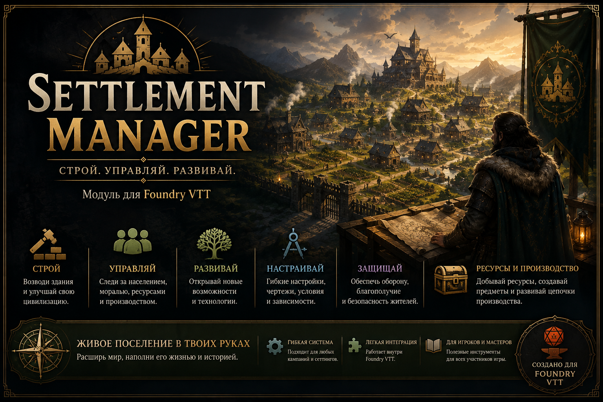

# Settlement Manager



**Settlement Manager** — модуль управления поселением для Foundry VTT 13.
Развивайте небольшую деревню в процветающий город, распределяйте ресурсы,
возводите здания и вместе с игроками создавайте историю своего поселения.

## Возможности

- строительство и улучшение зданий по игровому времени Foundry;
- управление населением, моралью, ресурсами и защитой;
- просьбы жителей и общие проекты с последствиями для поселения;
- чертежи, открывающие новые постройки и возможности;
- летопись важных событий и достижений;
- общий интерфейс для ГМа и игроков с синхронизацией изменений;
- собственные постройки, ресурсы и контент-паки.

## Установка

В Foundry VTT откройте **Add-on Modules → Install Module** и вставьте ссылку:

```text
https://raw.githubusercontent.com/vasabeerus73-collab/Settelment-Manager/main/module.json
```

После установки включите Settlement Manager в настройках мира.

Для ручной установки скачайте `settlement-manager.zip` из
[последнего релиза](https://github.com/vasabeerus73-collab/Settelment-Manager/releases/latest)
и распакуйте его в `Data/modules/settlement-manager`.

## Как открыть

Откройте Settlement Manager через макрос или консоль:

```js
Settlement.open();
```

## Dev-канал

Тестовые изменения публикуются отдельно от стабильной версии:

```text
https://raw.githubusercontent.com/vasabeerus73-collab/Settelment-Manager/Dev/module-dev.json
```

Dev-сборка использует тот же ID `settlement-manager` и заменяет стабильную сборку.
Перед тестированием в важном мире сделайте экспорт данных.

<details>
<summary><strong>Для разработчиков</strong></summary>

Проверка проекта:

```bash
npm run check
```

Основные вызовы API:

```js
Settlement.getData();
Settlement.addResource("wood", 10);
Settlement.canBuild("blacksmith");
Settlement.startConstruction("blacksmith");
Settlement.setBuildingAccess("townhall", "locked");
Settlement.grantBlueprint("bp-blacksmith");
Settlement.addChronicleEntry({ title: "Пришёл караван" });
```

Подробнее: [архитектура](ARCHITECTURE.md) и [история изменений](CHANGELOG.md).

</details>

## Лицензия

Settlement Manager распространяется по лицензии [GPL-3.0](LICENSE).
